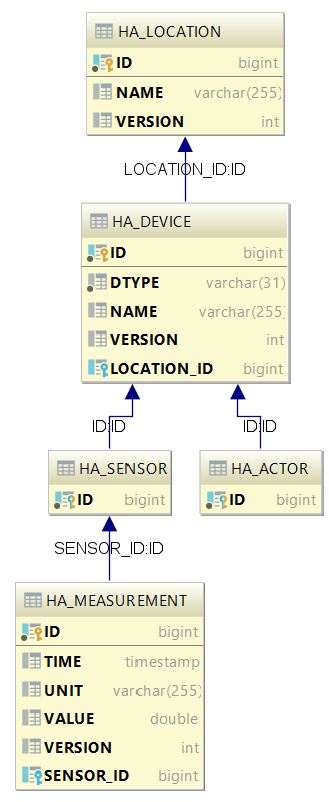
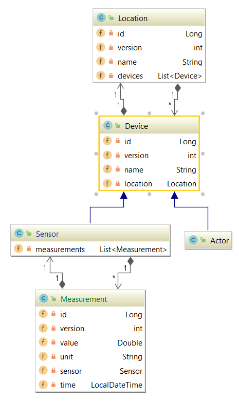

# Schwarcz Florian

# 1819_4bhif_nvs_assignment06_jpa
Übungsbeispiel mit individueller Aufgabenstellung zum Thema JPA

# Aufgabenstellung

- Jakarta EE Applikation
- Erstellen Sie (oder erweitern Sie) Ihr individuelles Datenmodell mit mindestens zwei abgeleiteten Klassen und insgesamt ca. fünf Tabellen.
- Erstellen Sie eine CRUD-Applikation (restful services) für die vererbten Klassen. Weiters ausgehend von Ihrem individuellem Thema ev. noch weitere notwendige Endpunkte.
- Ein Datum muss in Ihrem REST-Endpoint
- Verwenden Sie eine DerbyDb sowie eine H2
- Erstellen Systemtests auf Basis JavaSE.

# Beschreibung
Dieses Projekt dient zur Verwaltung von Heimautomationsgeräten wie Sensoren und Aktoren, wobei man von Sensoren und Aktoren weiß, in welchen Räumen sie sich befinden, und von Sensoren den Typ kennt, um zu wissen, was (Temperatur, Luftdruck, etc..) er in welcher Einheit (°C, bar) misst.

# ERD

# Klassendiagramm

